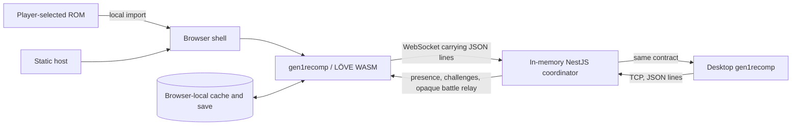

# Current architecture

**Status:** Draft current-state description
**Owner:** Maintainers of `gen1recomp/`, `backend/`, and `web/`
**Last verified:** 2026-08-27

## Components and data flow

## Ownership boundaries

| Component | Owns now | Does not own |
| --- | --- | --- |
| `web/` | Static launcher, local ROM selection/storage, WASM packaging, server selection | Game simulation or durable player data |
| `gen1recomp/` | Import/cache, world and battle execution, UI, saves, mods, MMO client | Authenticated identity or server validation |
| `backend/` | Connections, ephemeral UUIDs, map-scoped presence, challenge membership, battle IDs/seeds and relay | ROM/save data, collision, parties, outcomes, progression, persistence |
| `scripts/`, `Makefile` | Setup, build, launch, tunnel, and shutdown workflows | Production orchestration guarantees |
| `pokered/` | Imported upstream disassembly used by local development workflows | A distributable ROM |
| `DramaticShapeVoxelMod/` | Optional presentation mod | Coordinator authority |

## Trust boundaries

- ROM bytes and generated cache cross from a player-controlled file into the
  local client only. Permanent/static deployments must not ship either.
- Every client message crosses an untrusted network boundary. Zod validates
  message shape, but coordinates and battle payload contents remain
  client-authoritative.
- TCP and WebSocket are adapters around the same newline-delimited JSON
  protocol. A WebSocket frame is limited to 64 KiB; this is not yet a complete
  application-level compatibility contract.
- Installed Lua mods are trusted local code. The server must never execute
  client-supplied Lua.

## Lifecycle

After `join_world`, the coordinator assigns a UUID and sends snapshots. Moves
replace the reported position and broadcast within a map. An accepted challenge
creates a battle ID and shared random seed; clients run link battle locally and
the server relays opaque payloads. Disconnect removes presence, challenges, and
active battle membership. All coordinator state disappears on restart.

## Known gaps

There is no protocol negotiation, reconnect/resume, authoritative movement,
verifiable battle result, rate limiting, authentication, or persistence. See
the [source investigation](../ai_agents/source_investigation.md) for evidence
and the [proposed architecture](../proposed_architecture.md) for a non-binding
target.