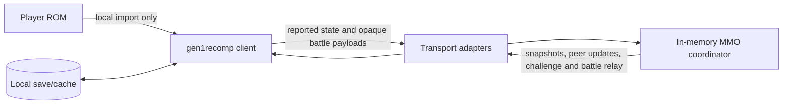
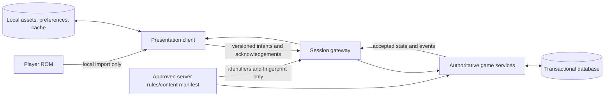

# Client/server relationship

**Status:** Proposed target boundary; current-state sections describe the
implementation verified on 2026-08-28

**Owners:** Client, protocol, backend, and persistence maintainers (unassigned)

**Applies to:** The browser and desktop clients, the MMO application server,
and any future persistence or simulation services

## Purpose

The target is a **server-authoritative multiplayer game with a local,
bring-your-own-ROM presentation client**. The server decides every fact that
can affect another player or durable progression. The client collects input,
renders the result, and keeps the player's ROM, extracted assets, and local
preferences on the player's device.

That target is deliberately reached in stages. The current private-session MVP
is a client-authoritative game connected to an ephemeral coordinator. It is
useful for presence and link battles, but it is not a trustworthy foundation
for accounts, rewards, trading, or an economy. P0 preserves that limited model;
P1 establishes explicit contracts and server validation; P2 introduces durable
identity and server-owned progression only after those contracts are proven.

This document defines the boundary and migration direction. It does not make
the proposed P1 or P2 behavior a current guarantee. The
[protocol catalogue](protocol.md) remains the detailed description of messages
implemented today, and architecture decisions must record material changes to
this target.

## Relationship principles

1. **The server is authoritative for shared and valuable state.** A client may
   predict an outcome for responsiveness, but the server's accepted state wins.
   This is necessary before battle outcomes, items, currency, progression, or
   trades can have durable value.
2. **The client is authoritative for private presentation.** Rendering, audio,
   controls, accessibility settings, interpolation, and other cosmetic choices
   do not need a network round trip and do not affect other players.
3. **Game data stays local unless a server contract requires a non-protected
   fact.** ROM bytes, saves, and ROM-derived assets must never be uploaded. A
   future server must use independently provisioned, approved rules/content
   data and exchange identifiers and state, not extracted client assets.
4. **The wire contract is transport-independent.** Native TCP and browser
   WebSocket adapters must expose the same application behavior. Transport
   framing, authentication, and reconnect mechanics may differ only below that
   shared contract.
5. **The client is untrusted at the server boundary.** Schema-valid is not the
   same as legal game behavior. Authentication, authorization, state-machine
   checks, rate limits, and domain validation belong on the server.
6. **Authority moves only with evidence.** Each migration needs a versioned
   contract, deterministic tests, compatibility behavior, observability, and a
   rollback plan. Storage must not be used to make unverified client claims
   durable.

## Current state

### Topology and lifecycle



The browser runs the same LÖVE game client as desktop. Desktop uses TCP; the
browser's Emscripten socket uses WebSocket. Both carry newline-delimited JSON
and enter the same NestJS coordinator. A connection sends `join_world`, the
coordinator assigns an ephemeral UUID, and all server state disappears on
disconnect or restart. There is no account, session resume, database, or server
world simulation.

The client reads its local map and player object and reports absolute position.
The coordinator validates message shape and whether the player is currently in
a battle, then stores and broadcasts the report. Remote clients materialize
those reports as passable runtime non-player characters. The server does not
load maps, check collision, establish legal transitions, or enforce movement
rate and sequence.

For a challenge, the coordinator owns map-scoped availability, pending
challenge membership, the battle UUID, host/guest roles, and a shared random
seed. The clients exchange party and compatibility data inside opaque
`battle_message` payloads, run the original link battle locally in lockstep,
and may each report that the battle ended. The coordinator does not understand
actions, parties, turns, results, rewards, or compatibility fingerprints.

### Current authority matrix

| Concern | Authority today | Server enforcement today | Consequence |
| --- | --- | --- | --- |
| ROM, extracted assets, save | Local client | No upload endpoint | Protected data remains local, as required |
| Rendering, audio, input, UI | Local client | None needed | Presentation can remain responsive and customizable |
| Identity and name | Server UUID for one connection; client-supplied name | Name shape/length only | No durable or recoverable identity |
| Map, position, facing | Client | Shape plus no movement during battle | A modified client can teleport or cross collision |
| Remote presence | Server coordinator replicates client reports | Same-map fan-out and disconnect cleanup | Useful social presence, not authoritative world state |
| Challenge membership | Server memory | Same map, availability, one pending challenge | The server reliably pairs current connections |
| Battle seed and pairing | Server memory | Battle membership and opponent routing | Messages are isolated, but battle truth is not verified |
| Party and compatibility | Client-to-client opaque payload | Battle membership only | The server cannot establish legal participants/content |
| Battle action, result, reward | Client lockstep/local save | None | Results must not grant durable value |
| Inventory and progression | Local save/client scripts | None | State is private, mutable, and device-local |
| NPCs, encounters, scripts | Client | None | Each client owns its own single-player world execution |
| Persistence | Browser/local filesystem | None | Server restart loses all multiplayer state |

### What the current server can and cannot promise

The current coordinator can promise best-effort private-session presence,
challenge routing, battle-message isolation, and cleanup for observed clean
disconnects. It cannot promise that a location, party, action, outcome, item,
or progression claim is legitimate. Valid JSON means only that a message has
the expected shape. Until authority changes, the product must remain a
non-persistent social proof of concept and must not attach competitive or
economic value to client-reported outcomes.

## Target state

### Target topology



The target protocol carries **intent**, not arbitrary replacement state. For
example, the client requests a step in a direction or selects a battle action;
the server validates it against the authenticated character, current session,
approved content version, and current state. The server commits the accepted
transition and emits authoritative state/events. Client-side prediction is an
optional optimization and must reconcile to server responses.

The application server owns sessions, world instances, movement validation,
encounters, battle simulation, state-changing scripts, inventory, trading,
rewards, and progression. A transactional database stores durable entities and
an audit trail where required. “Server” describes a logical authority boundary,
not a required monolith: it may remain one process initially and split into
services only when measurement justifies the operational cost.

The client continues to own rendering, animation, audio, menus, input mapping,
local interpolation/prediction, diagnostics, accessibility settings, and ROM
import. It may cache authoritative state for display or reconnect, but the
cache is not a source of truth. Offline single-player saves and MMO characters
must be explicitly distinct; the server must never silently ingest or trust a
local save as an MMO character.

### Target authority matrix

| Concern | Target authority | Client responsibility |
| --- | --- | --- |
| ROM and derived assets | Client device only | Import, extract, cache, and render locally; never upload |
| Protocol/content compatibility | Server-approved version and manifest | Present client/engine/rules fingerprints and refuse incompatible play |
| Identity and session | Authenticated server account/character | Securely hold a bounded session credential and support reauthentication |
| World instance and position | Server | Send movement intent, predict optionally, and reconcile corrections |
| Collision, warps, encounters | Server | Render accepted events and avoid treating prediction as committed state |
| Presence | Server projection of accepted world state | Interpolate authoritative snapshots/events |
| Challenge/match membership | Server | Request, accept, decline, and display lifecycle state |
| Party, moves, PP, status | Server | Render the permitted view and submit legal action choices |
| Battle RNG, actions, simulation | Server with explicit deterministic rules | Animate server events; prediction must be disposable |
| Results, rewards, evolution | Server transaction | Display acknowledgements and updated state |
| Inventory, currency, badges, progression | Server/database | Request commands; retain only display caches/preferences locally |
| NPCs and scripts | Server for state-changing behavior; client for cosmetic behavior | Render events and run only presentation-safe local effects |
| Mods/content | Server-approved manifest for shared mechanics | Load compatible local presentation assets; never upload executable Lua |
| Durable persistence | Server/database | Keep local settings and optional offline saves separate |

## Required changes and justification

The sequence below follows the charter milestones. Later steps are not a reason
to delay hardening the private-session MVP, and they must not be implemented by
quietly expanding the current unversioned protocol.

### P0: freeze and harden the private-session contract

1. **Document and test one application contract across TCP and WebSocket.** Add
   canonical valid/invalid fixtures and cover joins, map changes, challenge
   lifecycle, battle isolation, and disconnect cleanup. This supports the goal
   of one maintainable coordinator behavior for desktop and browser and makes
   the dependable two-player loop measurable.
2. **Make lifecycle failures explicit.** Define stable behavior for malformed,
   oversized, out-of-order, and state-inappropriate messages, and ensure a
   disconnect returns the remaining player to a usable overworld. This directly
   serves the dependable multiplayer loop without pretending the server already
   validates game rules.
3. **Preserve the local-data boundary.** Keep ROM import, extraction, saves, and
   derived assets out of every server request, log, fixture, and artifact. This
   is required by the project's bring-your-own-ROM goal and remains invariant
   at every later milestone.
4. **Keep current authority visible to users and developers.** Label movement
   and battle outcomes as unverified and keep accounts, rewards, trading, and
   economies out of P0. This prevents an ephemeral relay from being mistaken
   for a secure MMO backend.

### P1: establish a dependable authoritative session

1. **Add an explicit handshake.** Negotiate protocol, engine, ruleset, merged
   content, and approved-mod fingerprints before joining. Return a stable
   incompatibility response. Independently deployed static clients and servers
   otherwise drift without a safe migration path, undermining maintainability
   and battle determinism.
2. **Add resumable, bounded sessions.** Issue an opaque resume credential,
   define expiry and single-use/concurrency rules, and specify what happens to
   presence, pending challenges, and battles during a disconnect. This makes a
   browser/network interruption recoverable without introducing P2 accounts.
3. **Replace absolute movement updates with validated intent.** Give the server
   an approved map/collision/warp model, validate adjacency and plausible rate,
   enforce monotonically increasing input sequence numbers, and acknowledge or
   correct client prediction. This advances the charter's controlled movement
   authority goal and prevents impossible shared-world positions.
4. **Define a battle action and transcript contract.** Extract a serializable,
   deterministic turn resolver with explicit RNG; verify it headlessly against
   canonical client fixtures before selecting a server runtime. Replace opaque
   relay payloads only after that proof. This is necessary before a result can
   safely affect progression and preserves the original mechanics rather than
   attempting an untested rewrite.
5. **Add abuse controls and observability at the authority boundary.** Enforce
   per-connection/message limits, idle and challenge timeouts, and capacity
   bounds; measure joins, latency, errors, cleanup, and battle isolation. These
   controls provide the evidence required for the dependable pilot targets and
   make validation failures operable rather than invisible.

### P2: introduce durable MMO state

1. **Authenticate accounts and authorize characters.** Define registration or
   identity-provider flows, credential recovery, session revocation, and player
   deletion before associating network commands with durable state. Ephemeral
   connection UUIDs cannot safely own persistent characters.
2. **Define domain state before database persistence.** Specify versioned
   character, Pokémon, party, inventory, progression, battle, and world models,
   including ownership and invariants, then map them to migrations. This avoids
   freezing today's client save layout or unverified claims into the database.
3. **Commit progression atomically on the server.** Encounters, battles,
   rewards, evolution, inventory changes, and trades must validate and commit as
   transactions with idempotency and concurrency rules. This is the core change
   that turns the proof of concept into a dependable persistent MMO.
4. **Separate offline/local and online/server characters.** Provide explicit
   UI and storage namespaces and do not accept arbitrary local-save imports into
   the authoritative economy. This preserves the bring-your-own-ROM experience
   without granting clients a path to manufacture server-owned state.
5. **Partition only after measuring capacity.** Add world instances and service
   boundaries with documented consistency, deployment, rollback, backup, and
   recovery semantics when pilot evidence requires them. This serves
   extensibility without sacrificing the project's maintainability goal to
   premature distributed-system complexity.

## Command and event shape in the target model

A target exchange should make acceptance observable:

```text
client:  command(id, session, expectedVersion, movement-or-battle intent)
server:  accepted(id, newVersion, authoritative events)
     or  rejected(id, stableReason, currentVersion/correction)
```

Command IDs provide idempotency across retries. State versions expose stale
commands and allow reconciliation. Stable rejection reasons let the client
recover without parsing prose. Server events contain game-state facts and
presentation cues, but never ROM bytes or derived assets. Exact schemas require
separate protocol decisions and compatibility fixtures; this sketch is a
constraint, not an implemented message catalogue.

## Trust, privacy, and security boundary

- Treat all coordinates, identifiers, timestamps, fingerprints, actions, and
  payload sizes received from a client as hostile until authenticated,
  authorized, schema-validated, and checked against current domain state.
- Never run client-supplied Lua or accept a client-supplied rules bundle. A
  server-authoritative simulation uses a reviewed, operator-selected content
  set and compares fingerprints with clients.
- Use TLS for public browser connections. Credentials must not appear in query
  strings or logs; resume/authentication material needs expiry, rotation, and
  revocation rules.
- Send each client only the state it is allowed to observe. Server authority
  does not justify exposing another player's private party, inventory, account,
  or session data.
- Keep local ROM/cache/save storage outside account deletion and server backup
  claims. Conversely, make durable server data retention, export, and deletion
  explicit before P2 launch.

## Compatibility and migration rules

- Introduce negotiation before the first breaking protocol change. During a
  bounded rollout, support the previous compatible version or reject it with an
  actionable version error; never guess a peer's semantics.
- Migrate one authority domain at a time. Do not accept both a client-reported
  result and a server-computed result as equally authoritative.
- Run old and new calculations in shadow mode only for measurement; only one
  path may commit state. Compare deterministic transcripts before cutover.
- Keep adapters thin. TCP and WebSocket translate framing and connection events,
  while the same application command handler owns validation and results.
- Record accepted target changes in architecture decision records and update the
  protocol, client compatibility notes, tests, operations guidance, and rollback
  procedure in the same change.

## Acceptance evidence

The target relationship is not achieved merely by adding endpoints or tables.
Each authority migration needs:

- schema and state-machine tests for valid, invalid, duplicate, stale, and
  unauthorized commands;
- cross-transport contract tests and a supported client/server version matrix;
- deterministic replay tests for battle or world simulation changes;
- disconnect, retry, timeout, rollback, and transactional fault tests;
- proof that published artifacts and network captures contain no ROM, save, or
  ROM-derived assets; and
- measurements against the charter's join, latency, battle-isolation, cleanup,
  capacity, and recovery targets as they become applicable.

Until this evidence exists, the relevant row in the target matrix remains a
proposal and the current authority matrix governs product claims.

## Explicit non-goals and open decisions

This boundary does not require server-side rendering, uploading a ROM, running
the complete LÖVE client headlessly, public matchmaking, massive concurrency,
microservices, or later-generation mechanics. P0 and P1 do not require accounts
or a production database.

The following choices remain open and require prototypes or architecture
decisions: the server battle runtime (headless Lua, a separate simulation
service, or a verified port), the independently provisioned legal content
representation used for validation, authentication provider and account policy,
database engine, world partitioning model, and whether any offline character
import can be made safe. None of those choices may weaken the authority or
local-ROM boundaries defined above.